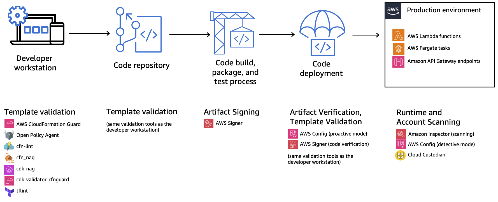

## Overview
This repository packages components for a serverless governance in depth strategy as outlined in this [guide](https://serverlessland.com/content/service/lambda/guides/governance/1-introduction) and discussed in this [re:Invent 2023 breakout session](https://www.youtube.com/watch?v=qlz15v-gHFI). Each feature or capability is implemented as an individual module for deployment. Below is an overview of how controls can be applied within your software delivery pipeline.

The components in this repository are also intended as a model of how these controls can be implemented in your governance strategy, rather than as an exhaustive implementation of all possible controls. While some relevant controls will be implemented as part of this repository, other repositories provide additional examples:
* https://docs.aws.amazon.com/controltower/latest/userguide/lambda-rules.html
* https://github.com/awslabs/aws-config-rules
* https://github.com/awslabs/serverless-rules/

## Modules
This repository is organized in modules by the control type and the AWS service that enables that control type. The diagram outlines open source alternatives that enable the same functionality.
* Detective: Config
* Preventative: Service Control Policies (pending)
* Proactive: CloudFormation Guard
* Security: IAM, Inspector, Signer

Each module is implemented using [AWS SAM](https://docs.aws.amazon.com/serverless-application-model/latest/developerguide/what-is-sam.html), [AWS CDK](https://docs.aws.amazon.com/cdk/v2/guide/getting_started.html), and [Terraform](https://registry.terraform.io/providers/hashicorp/aws/latest/docs).

## Security
See [CONTRIBUTING](CONTRIBUTING.md#security-issue-notifications) for more information.

## License
This library is licensed under the MIT-0 License. See the LICENSE file.